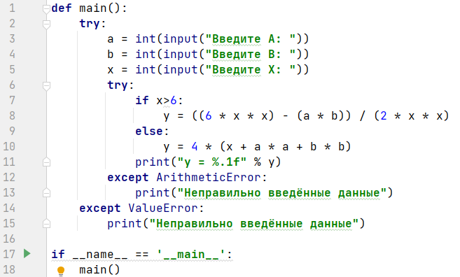

# ArSePythonCross
**Practical tasks for "Cross-platform applications development" university course**

_Этот репозиторий предназначен для хранения файлов программ на языке Python для университетского курса "Разработка кроссплатформенных приложений"._

